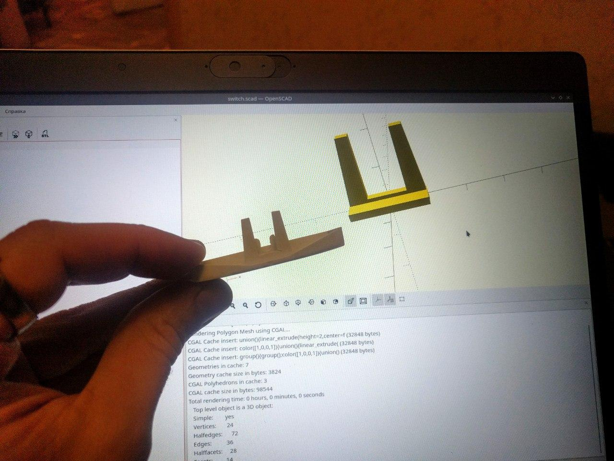
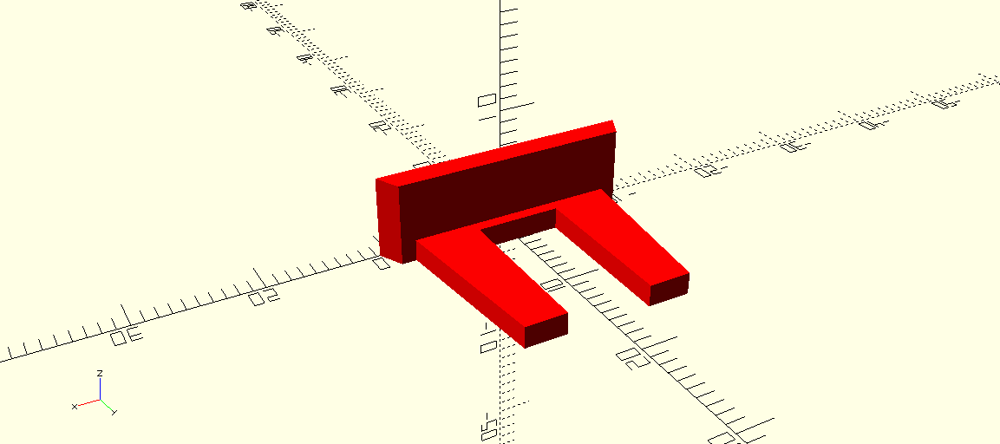
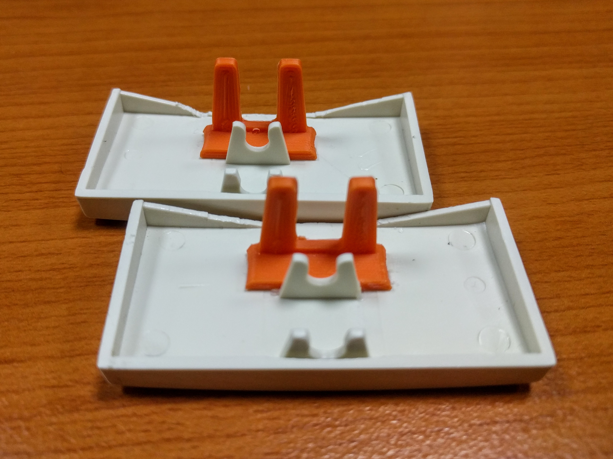
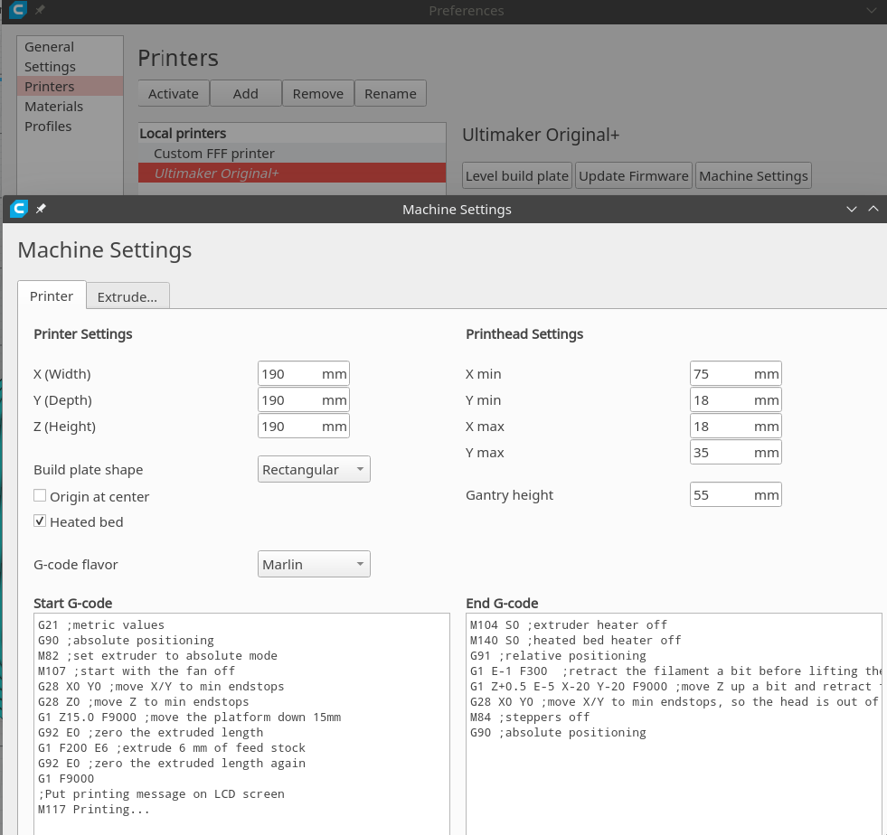
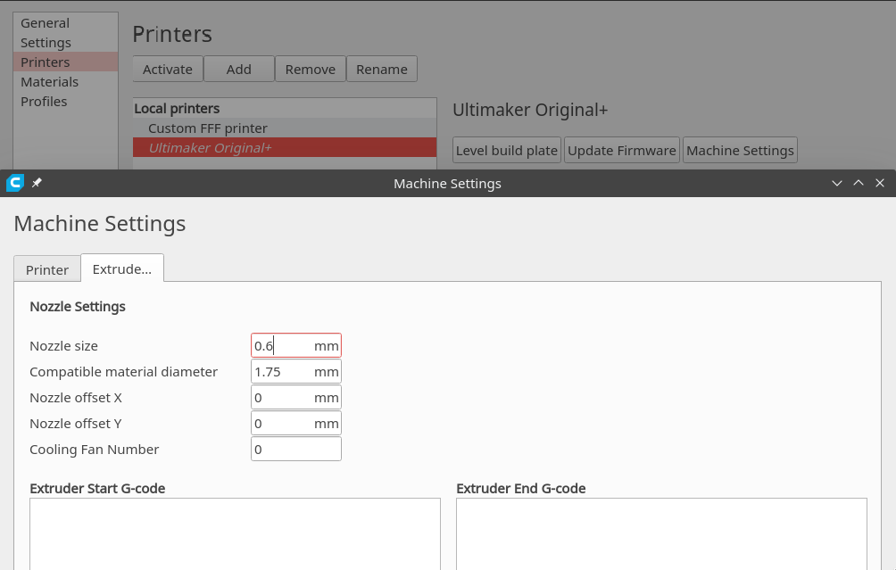

# 3d-switch

Replacement part for the electric switch

Assembled:

## Project content

- final [.gcode file](switch.gcode), prepared by CURA slicer
- [.stl file](switch.stl)
- openSCAD [source file](switch.scad)
- [printing profile](my-printing.curaprofile) for CURA

## Printer settings

Derived from "Ultimaker Original +"

